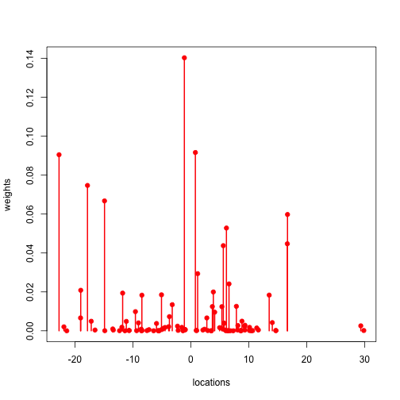

<style>
em {
  font-style: italic
}
strong {
  font-weight: bold;
}
</style>

## What is the stick breaking process (SBP)?
* stick breaking is a constructive process for putting a distribution on a (potentially)
infinite dimensional object, such as the natural numbers, $\mathbf{N}$
      + $\mathbf{N}$: 1, 2, 3, ...
* the SBP generates an infinite sequence that sums to 1 (<em>i.e.,</em> a distribution)
* the distribution is random in two ways
      + the stick lengths are random
      + the atom locations are random
* the SBP distribution is <em>discrete</em> or <em>atomic</em>
* stick breaking is used in Bayesian nonparametrics to sample from Dirichlet processes
* see <em>[Bayesian Nonparametric Learning: Expressive Priors for Intelligent Systems](http://www.cs.berkeley.edu/~jordan/publications.html)</em> 
by Michael Jordan for details on the SBP and its role in Bayesian nonparametrics
* the SBP Shiny app lives here: <https://knigge.shinyapps.io/Shiny>

--- .class #id #id &twocol

## Sticks 
*** =left 
* draw an infinite sequence of beta random variables $(Z_n)_{n \ge 1}$ with 
$Z_i \sim \mathrm{Beta}(1, \alpha)$
      + where $\alpha$ is known as the <em>concentration</em> parameter
* now, let's break our beta sticks
      + set $\pi_1 = Z_1$
      + set $\pi_k = Z_k \prod_{j = 1}^{k - 1}(1 - Z_j)$
* for example, $\pi_2 = Z_2 \cdot (1 - Z_1)$
* each $\pi_k$ is a portion of the (unit) stick
* note that the $\pi_k$'s sum to 1 (with probability 1)
      + <strong>hint:</strong> look at $1 - \sum_{k=1}^{\infty} \pi_k$ and replace $\pi$'s with $Z$'s

*** =right


```r
# Number of atoms and random number seed
n <- 100; set.seed(222)

# Sample beta weights
betas <- rbeta(n, 1, 10); 
sticks <- 1 - betas; stick_prod <- rep(0, n)

# Calculate products before pi vlaues
stick_prod <- cumprod(sticks)

# Stick-breaking weights
pi <- rep(0, n); pi[1] <- betas[1]; 
pi[2:(n-1)] <- betas[2:(n-1)] * 
                  stick_prod[1:(n-2)]
# Allocate remaining mass to last pi weight
pi[n] <- 1 - sum(pi[1:n-1])
```

--- .class #id 

## Locations
the atom locations live on some (measurable) space $\Omega$ (<em>e.g.,</em> the real numbers, $\mathbf{R}$)

* pick a distribution $G_0$, (<em>e.g.,</em> normal, gamma, beta, Cauchy, etc.) 
and draw an infinite sample (i.i.d.) from that distribution
      + call this sequence of random variables $(\varphi_k)_{k \ge 1}$
* put a point-mass (<em>i.e.,</em> a stick of length one) at each $\varphi_k$ 
and call that $\delta_{\varphi_k}$
* define $$G = \sum_{k = 1}^{\infty} \pi_k \delta_{\varphi_k}$$ and you have a random probability measure that lives on $\Omega$


```r
# Sample from base measure---these are the phi_k's
G0 <- rnorm(n, 0, 10)
```

--- .class #id &twocol

## Random measure
*** =left


```r
# Plot resulting random measure
plot(G0, pi, type = "h", col = "red", lwd = 2, 
     xlab = "locations", ylab = "weights")
points(G0, pi, pch = 19, col = "red")
```

* here's an example where $\varphi_k \stackrel{iid}{\sim} N(0, 10)$
* the $\varphi_k$'s give the x-axis locations
* the $\pi_k$'s give the <em>weights</em> or <em>probabilities</em>
* there are 100 atoms in this example
      + the 100th atom gets the mass of $\sum_{k=100}^{\infty}\pi_k = 
      1 -\sum_{k=1}^{99}\pi_k$
      + this sum amounts to probability of 1.2 &times; 10<sup>-4</sup>
*** =right
 
